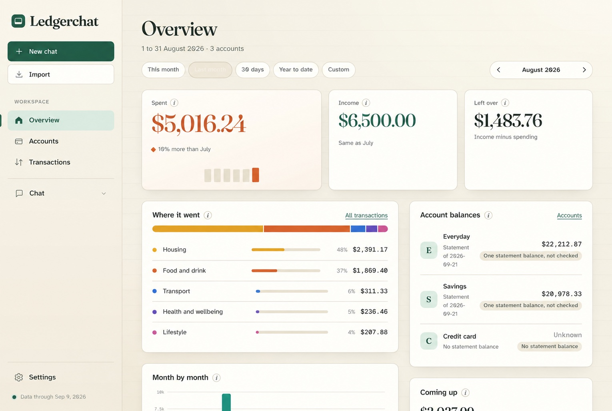

# ledgerchat

Ask questions about your bank transactions in plain language, answered by a
model that runs on your own machine and can only read your data through six
SQL-backed tools. Import a CSV or OFX export, let the model label it once, and
ask: "How much did I spend on groceries last month?", "What are my recurring
charges?", "Compare dining in August with July".



ledgerchat runs on your device. The server listens on `127.0.0.1` only, the
web page loads nothing from the network (even the fonts are served from
installed packages), and there is no telemetry. ledgerchat sends transaction
data only to the model endpoint you configure, which must use `localhost`,
`127.0.0.1` or `[::1]`. Use a model server you trust, since it controls any
onward processing.

## What is in it

- **Overview**: spending, income and what is left for a period, where the
  money went by category, month-by-month bars, statement balances checked
  against posted movements, regular charges and what is coming up.
- **Accounts**: every imported account with its coverage and latest balance.
- **Transactions**: search, filter and page through the ledger; correct a
  category for one transaction or for every transaction with the same
  description.
- **Chat**: the model answers with the six tools below, shows every tool call
  it made, and saves the conversation.
- **Settings**: the local model server, the model to use and whether it may
  think before answering.
- **Import**: CSV and OFX/QFX with column detection, a 20-row preview and
  duplicate-safe re-imports.

## Prerequisites

- Node 24 (`.nvmrc` pins it) and pnpm 11 (`corepack enable`).
- A local OpenAI-compatible server serving a tool-calling model: Ollama, oMLX,
  LM Studio, llama.cpp or vLLM. See [docs/local-models.md](docs/local-models.md).

## Quickstart

Clone this repository using GitHub's **Code** button, then run these commands
from the repository directory:

```sh
nvm use && pnpm install
pnpm auth:show              # shows the local browser login
pnpm dev                    # http://localhost:3000
```

Open the local page and sign in with the username and password shown by
`pnpm auth:show`. The password is generated on first use and kept in an
owner-readable `server-password` file beside the database; it stays the same
across restarts. Then open **Settings**, enter your model server's URL (Ollama is
`http://localhost:11434`, oMLX is `http://localhost:8000`), press **Refresh
models**, pick one and save. Then either **Load sample data** from the empty
Overview, or **Import** a file of your own.

The sample is twelve months of synthetic transactions (three accounts, AUD,
Sydney merchants), imported through the same path as a real file and then
labelled by your model. It takes a few minutes on a laptop. The same load is
`pnpm seed` from the terminal, with the model taken from `.env`
(`cp .env.example .env`, then set `LOCAL_LLM_MODEL`). Blank optional settings
use their defaults.

## Import your own file

**Import** in the sidebar: drop a CSV or OFX/QFX export, pick or create the
account, check the detected columns and the preview, import, then
**Categorise now**. From the terminal:

```sh
pnpm import:file ~/Downloads/everyday.csv --create-account Everyday --dry-run
pnpm import:file ~/Downloads/everyday.csv --account Everyday
pnpm categorise
```

Columns, date format and sign convention are auto-detected with a confidence
per role and can be overridden. Re-importing an overlapping export updates rows
rather than duplicating them. Details are in [docs/import.md](docs/import.md).

## What the model can do

Six tools, all read-only over SQLite: `list_accounts`, `search_transactions`,
`get_spending_summary`, `get_cash_flow`, `get_recurring_charges` and
`get_upcoming_payments`. The prompt asks the model to quote tool results
instead of calculating totals. For straightforward spending comparisons,
ledgerchat renders the dated totals, change and any requested percentage from a
single `get_spending_summary` result. If the model does not supply that result,
it withholds the comparison. It also checks named categories and descriptions,
account and transfer filters, and relative or explicit date ranges against the
tool windows. Yearless month names resolve to their most recent occurrence in
UTC; the current month ends today. If imported transactions do not overlap a
requested period, the comparison is unavailable rather than treated as zero.
A comparison that also asks for top merchants uses the tool's merchant grouping
and labels the ranked results as transaction descriptions. Direct balance and
cash-flow answers are also rendered from their tool results, with amounts tied
to the account or dated metric. Other answers pass a
narrower check: their currency
amounts and percentages must match typed values returned by tools in that
request, or the answer is withheld and the model gets one chance to correct it.
The loop also stops exact repeated calls and caps a request at eight turns.
Outside the application-rendered comparisons, the value check cannot prove that
a supported amount was attributed to the right merchant, category or period,
so inspect the shown tool calls for decisions that matter.

Labels are a two-level taxonomy (13 categories, 38 subcategories) applied once
per distinct description and correctable in Transactions; see
[docs/categories.md](docs/categories.md). Transfers are matched only when both
legs look transfer-like and each has one plausible counterpart. You can correct
a transfer decision in Transactions.

## Where things live

The database is SQLite in the platform data directory
(`~/Library/Application Support/ledgerchat/` on macOS,
`$XDG_DATA_HOME/ledgerchat/` on Linux, `%APPDATA%\ledgerchat\` on Windows),
overridable with `DB_PATH`. It holds accounts, transactions, labels,
corrections, balances, import runs and saved chats. `model-settings.json`
holds the Settings page's choices and `server-password` holds the browser login,
both beside the database with owner-only permissions. To start over, stop the
server and delete the database and its `-wal` and `-shm` files. Delete
`model-settings.json` only to reset the model choice and `server-password` only
to generate a new browser password.

The server requires the local password for every page and API request, refuses
cross-origin writes, and logs neither request bodies nor query strings.

## Scripts

| Script                             | What it does                                   |
| ---------------------------------- | ---------------------------------------------- |
| `pnpm dev`                         | Run the server with reload                     |
| `pnpm seed [--force]`              | Load the sample dataset and categorise it      |
| `pnpm import:file <file>`          | Import a CSV or OFX/QFX export                 |
| `pnpm categorise [--recategorise]` | Label descriptions with the model              |
| `pnpm chat "question"`             | One-shot chat from the terminal                |
| `pnpm auth:show`                   | Show the local browser login                   |
| `pnpm build` / `pnpm start`        | Compile to `dist/` and run the compiled server |
| `pnpm typecheck` / `lint` / `test` | Checks; CI runs all three                      |

## Docs

- [docs/local-models.md](docs/local-models.md): Ollama and oMLX setup, thinking, structured output.
- [docs/import.md](docs/import.md): CSV and OFX details, the mapping rules, dedup.
- [docs/categories.md](docs/categories.md): the taxonomy, the tool contract, corrections.
- [CONTRIBUTING.md](CONTRIBUTING.md): checks and the contribution licence.

## Licence

Copyright © 2026 Billy Dharmawan.

ledgerchat is licensed under the [Elastic License 2.0](LICENSE). You may run,
study, modify and share it, including for your own local or internal use. The
licence prohibits providing substantial ledgerchat functionality to third
parties as a hosted or managed service. This is a source-available licence,
not an open-source licence. See [CONTRIBUTING.md](CONTRIBUTING.md) if you want
to contribute.
